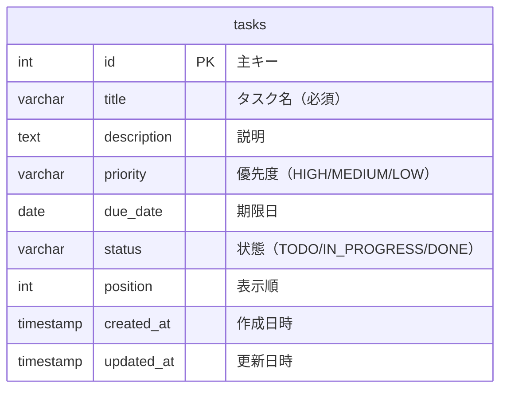

# E-R図（データ設計書）

データベース：PostgreSQL 16

---

## 1. テーブル一覧

| テーブル名 | 役割 |
|-----------|------|
| tasks | タスクの情報 |

---

## 2. E-R図

---

## 3. テーブル詳細

### tasks（タスクテーブル）

| カラム名 | 型 | 制約 | 説明 |
|---------|-----|------|------|
| id | SERIAL | PK | 主キー（自動採番） |
| title | VARCHAR(200) | NOT NULL | タスクの名前 |
| description | TEXT | NULL可 | タスクの詳細説明 |
| priority | VARCHAR(10) | NOT NULL, DEFAULT 'MEDIUM' | 優先度（HIGH / MEDIUM / LOW） |
| due_date | DATE | NULL可 | 期限日 |
| status | VARCHAR(20) | NOT NULL, DEFAULT 'TODO' | 状態（TODO / IN_PROGRESS / DONE） |
| position | INT | NOT NULL, DEFAULT 0 | 一覧内の表示順 |
| created_at | TIMESTAMP | NOT NULL, DEFAULT CURRENT_TIMESTAMP | 作成日時 |
| updated_at | TIMESTAMP | NOT NULL, DEFAULT CURRENT_TIMESTAMP | 更新日時 |

---

## 4. CHECK 制約

| カラム | 許可する値 |
|--------|-----------|
| priority | `'HIGH'`, `'MEDIUM'`, `'LOW'` |
| status | `'TODO'`, `'IN_PROGRESS'`, `'DONE'` |
