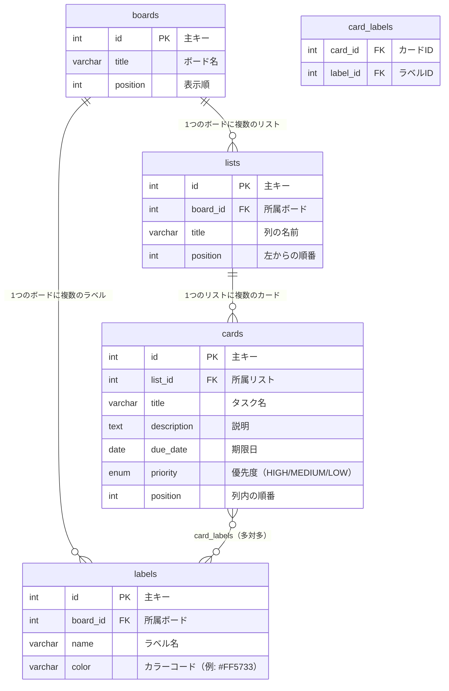

# E-R図（データ設計書）

データベース：PostgreSQL

---

## 1. テーブル一覧

| テーブル名 | 役割 |
|-----------|------|
| boards | ボード（作業スペース）の情報 |
| lists | リスト（列）の情報 |
| cards | カード（タスク）の情報 |
| labels | ラベル（色タグ）の情報 |
| card_labels | カードとラベルの紐付け（中間テーブル） |

---

## 2. E-R図



---

## 3. テーブル詳細

### boards（ボードテーブル）

| カラム名 | 型 | 制約 | 説明 |
|---------|-----|------|------|
| id | INT | PK, AUTO_INCREMENT | 主キー |
| title | VARCHAR(100) | NOT NULL | ボードの名前 |
| position | INT | NOT NULL | 一覧での表示順（1, 2, 3…） |

---

### lists（リストテーブル）

| カラム名 | 型 | 制約 | 説明 |
|---------|-----|------|------|
| id | INT | PK, AUTO_INCREMENT | 主キー |
| board_id | INT | FK → boards.id | どのボードの列か |
| title | VARCHAR(100) | NOT NULL | 列の名前（例：「やること」） |
| position | INT | NOT NULL | ボード内の左からの順番 |

---

### cards（カードテーブル）

| カラム名 | 型 | 制約 | 説明 |
|---------|-----|------|------|
| id | INT | PK, AUTO_INCREMENT | 主キー |
| list_id | INT | FK → lists.id | どのリスト（列）に入っているか |
| title | VARCHAR(200) | NOT NULL | タスクの名前 |
| description | TEXT | NULL可 | タスクの詳細説明 |
| due_date | DATE | NULL可 | 期限日 |
| priority | ENUM | NOT NULL | 優先度（HIGH / MEDIUM / LOW） デフォルト：MEDIUM |
| position | INT | NOT NULL | リスト内の上からの順番 |

---

### labels（ラベルテーブル）

| カラム名 | 型 | 制約 | 説明 |
|---------|-----|------|------|
| id | INT | PK, AUTO_INCREMENT | 主キー |
| board_id | INT | FK → boards.id | どのボードのラベルか |
| name | VARCHAR(50) | NOT NULL | ラベルの名前（例：「バグ」） |
| color | VARCHAR(7) | NOT NULL | カラーコード（例：#FF5733） |

---

### card_labels（中間テーブル）

カードとラベルの「多対多」の関係を解決するテーブルです。

| カラム名 | 型 | 制約 | 説明 |
|---------|-----|------|------|
| card_id | INT | FK → cards.id | カードのID |
| label_id | INT | FK → labels.id | ラベルのID |

card_id + label_id の組み合わせが主キーになります（複合主キー）。

---

## 4. リレーション（テーブル間のつながり）

```
boards
  │ id ──────────────────────────┐
  │                              │
  ▼ (board_id)                   ▼ (board_id)
lists                          labels
  │ id                            │ id
  │                               │
  ▼ (list_id)                     │
cards                             │
  │ id ──────────────────────── card_labels ──── label_id ─────┘
```

| 関係 | 説明 |
|------|------|
| boards → lists | 1つのボードに複数のリストが存在する（1対多） |
| lists → cards | 1つのリストに複数のカードが存在する（1対多） |
| boards → labels | 1つのボードに複数のラベルが存在する（1対多） |
| cards ↔ labels | 1枚のカードに複数ラベルを付けられる（多対多） |

---

## 5. 削除時の連動動作（CASCADE）

| 削除対象 | 連動して削除されるもの |
|---------|---------------------|
| boards を削除 | 配下の lists・cards・labels・card_labels もすべて削除 |
| lists を削除 | 配下の cards・card_labels もすべて削除 |
| cards を削除 | 対応する card_labels も削除 |
| labels を削除 | 対応する card_labels も削除（カード自体は残る） |
