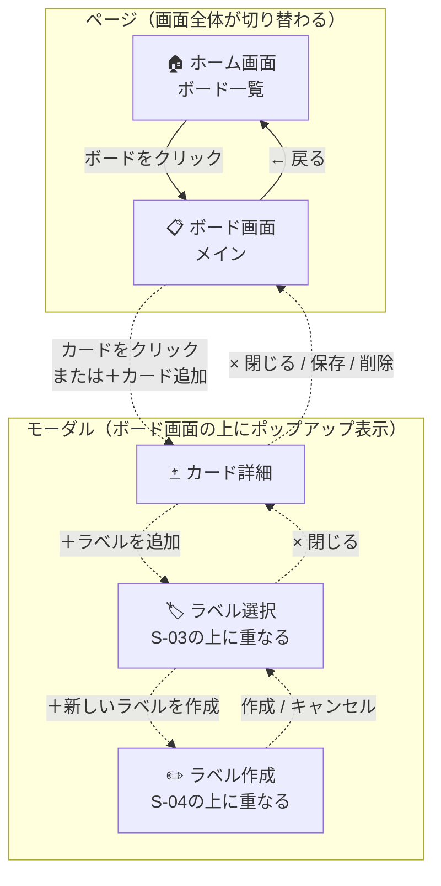

# 画面遷移・設計書

---

## 1. 画面一覧

| 画面ID | 画面名 | 種類 | 説明 |
|--------|--------|------|------|
| S-01 | ホーム画面（ボード一覧） | ページ | アプリ起動時に最初に表示される |
| S-02 | ボード画面（メイン） | ページ | ボードをクリックすると表示される |
| S-03 | カード詳細 | モーダル | カードをクリックすると S-02 の上に重なる |
| S-04 | ラベル選択 | モーダル | S-03 上で「＋ラベルを追加」をクリックすると開く |
| S-05 | ラベル作成 | モーダル | S-04 上で「＋新しいラベルを作成」をクリックすると開く |

---

## 2. 画面遷移図

**凡例：**
- 実線矢印 `──▶` … ページ全体が切り替わる遷移（URLが変わるイメージ）
- 破線矢印 `- - ▶` … モーダル（ポップアップ）が開く・閉じる（ページは変わらない）



**モーダルの重なり方：**

```
ボード画面（S-02）
  └─ カード詳細モーダル（S-03）…ボード画面の上に重なる
       └─ ラベル選択モーダル（S-04）…カード詳細の上に重なる
            └─ ラベル作成モーダル（S-05）…ラベル選択の上に重なる
```

---

## 3. 画面別仕様

### S-01 ホーム画面（ボード一覧）

アプリを開いたときに最初に表示される画面です。

```
┌────────────────────────────────────────────────────────┐
│  タスク管理アプリ                                       │  ← ヘッダー
├────────────────────────────────────────────────────────┤
│                                                        │
│  ┌──────────┐  ┌──────────┐  ┌──────────┐            │
│  │  仕事用  │  │  個人用  │  │  学習用  │  ← ボードカード
│  │  [編集]  │  │  [編集]  │  │  [編集]  │
│  │  [削除]  │  │  [削除]  │  │  [削除]  │
│  └──────────┘  └──────────┘  └──────────┘
│                                                        │
│  ┌────────────────┐                                   │
│  │  + 新しいボード │                                   │
│  └────────────────┘                                   │
└────────────────────────────────────────────────────────┘
```

**操作一覧：**

| 操作 | 結果 |
|------|------|
| ボードをクリック | S-02（ボード画面）へ遷移 |
| [編集] をクリック | ボードのタイトルを編集 |
| [削除] をクリック | 確認後、ボードと中のデータをすべて削除 |
| [+ 新しいボード] をクリック | タイトルを入力して新しいボードを作成 |

---

### S-02 ボード画面（メイン）

リストとカードを管理する中心的な画面です。

```
┌────────────────────────────────────────────────────────────────────┐
│  ← 戻る  |  仕事用ボード  [タイトル編集]                           │
├────────────────────────────────────────────────────────────────────┤
│                                                                    │
│  ┌──────────────┐  ┌──────────────┐  ┌──────────────┐            │
│  │ やること      │  │ 進行中        │  │ 完了          │
│  │ [編集][削除] │  │ [編集][削除] │  │ [編集][削除] │
│  ├──────────────┤  ├──────────────┤  ├──────────────┤
│  │ [高]         │  │ [中]         │  │ [低]         │  ← 優先度バッジ
│  │ タスクA      │  │ タスクC      │  │ タスクE      │
│  │ 期限: 5/1   │  │ ラベル:バグ  │  │              │
│  ├──────────────┤  ├──────────────┤  ├──────────────┤
│  │ + カード追加 │  │ + カード追加 │  │ + カード追加 │
│  └──────────────┘  └──────────────┘  └──────────────┘
│                                                                    │
│  ┌───────────┐                                                     │
│  │ + リスト追加 │                                                   │
│  └───────────┘                                                     │
└────────────────────────────────────────────────────────────────────┘
```

**操作一覧：**

| 操作 | 結果 |
|------|------|
| [← 戻る] をクリック | S-01（ホーム画面）へ遷移 |
| カードをクリック | S-03（カード詳細モーダル）を開く |
| [+ カード追加] をクリック | S-03（カード詳細モーダル）を開く（新規作成モード） |
| カードをドラッグ | 別のリストや別の位置へ移動 |
| リストをドラッグ | 列を左右に並び替え |
| リストの [編集] | リスト名を変更 |
| リストの [削除] | 確認後、リストと中のカードをすべて削除 |
| [+ リスト追加] をクリック | 新しい列（リスト）を追加 |

**カードに表示される情報：**

| 表示要素 | 表示されるタイミング |
|---------|-------------------|
| カードタイトル | 常に表示 |
| 優先度バッジ（高・中・低） | 常に表示 |
| 期限日 | 期限日が設定されている場合 |
| ラベル（色帯） | 1つ以上ラベルが設定されている場合 |

---

### S-03 カード詳細モーダル

カードをクリックすると S-02 の上に重なって表示されるポップアップです。

```
┌───────────────────────────────────────────────────────────┐
│  [× 閉じる]                                               │
│                                                           │
│  タイトル                                                  │
│  ┌────────────────────────────────────────────────────┐  │
│  │ タスクAのタイトル                                   │  │
│  └────────────────────────────────────────────────────┘  │
│                                                           │
│  優先度: [高 ▼]  （高・中・低から選択）                    │
│                                                           │
│  期限日: [ 2026-05-01 ]                                   │
│                                                           │
│  ラベル                                                    │
│  ┌─────────────────────────────────────┐                 │
│  │ [バグ ×]  [機能追加 ×]              │                 │
│  │ [+ ラベルを追加]                    │                 │
│  └─────────────────────────────────────┘                 │
│                                                           │
│  説明                                                     │
│  ┌────────────────────────────────────────────────────┐  │
│  │  （ここにメモを書く）                               │  │
│  └────────────────────────────────────────────────────┘  │
│                                                           │
│  [保存]                            [カードを削除]         │
└───────────────────────────────────────────────────────────┘
```

**操作一覧：**

| 操作 | 結果 |
|------|------|
| [× 閉じる] または画面外クリック | S-02 に戻る（モーダルを閉じる） |
| [保存] をクリック | 変更を保存して S-02 に戻る |
| [カードを削除] をクリック | 確認後、カードを削除して S-02 に戻る |
| [+ ラベルを追加] をクリック | S-04（ラベル選択モーダル）を開く |

---

### S-04 ラベル選択モーダル

S-03 の上にさらに重なって表示されるポップアップです。

```
┌──────────────────────────┐
│  ラベルを選択             │
│ ─────────────────────── │
│  [✓] バグ                │
│  [ ] 機能追加            │
│  [ ] 緊急                │
│ ─────────────────────── │
│  + 新しいラベルを作成    │
└──────────────────────────┘
```

**操作一覧：**

| 操作 | 結果 |
|------|------|
| ラベルにチェックを入れる | カードにラベルを付与 |
| ラベルのチェックを外す | カードからラベルを取り外し |
| [× 閉じる] | S-03（カード詳細）に戻る |
| [+ 新しいラベルを作成] をクリック | S-05（ラベル作成モーダル）を開く |

---

### S-05 ラベル作成モーダル

S-04 の上にさらに重なって表示されるポップアップです。

```
┌──────────────────────────┐
│  ラベルを作成             │
│ ─────────────────────── │
│  名前: [        ]        │
│  色:   [■][■][■][■]    │
│ ─────────────────────── │
│  [作成]     [キャンセル]  │
└──────────────────────────┘
```

**操作一覧：**

| 操作 | 結果 |
|------|------|
| 名前・色を入力して [作成] をクリック | ラベルを新規作成して S-04 に戻る |
| [キャンセル] をクリック | 作成せずに S-04 に戻る |
